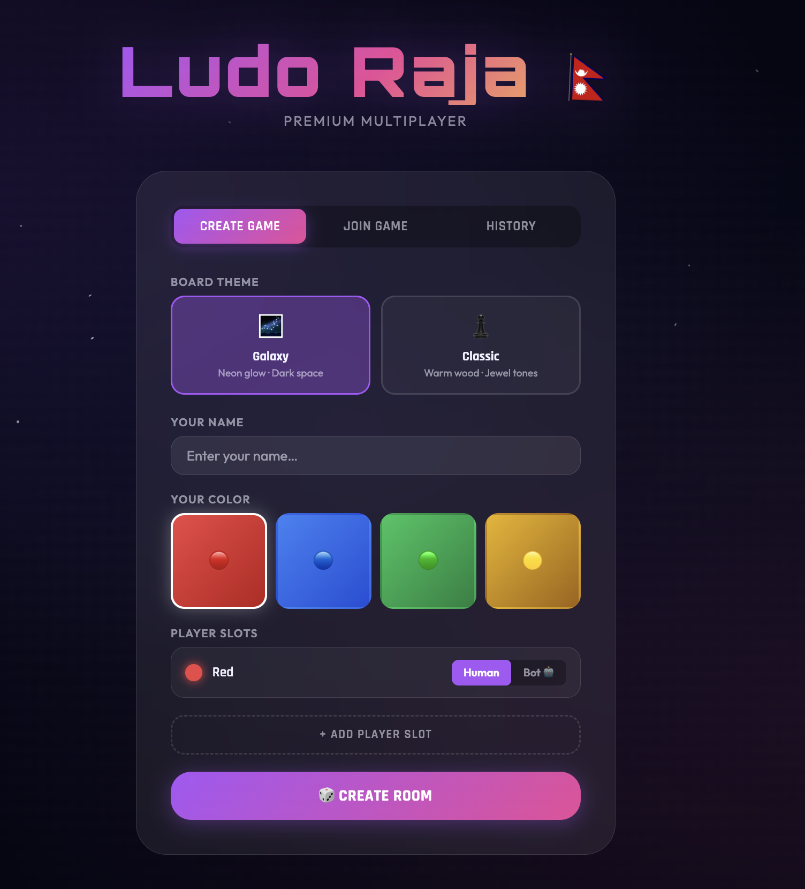
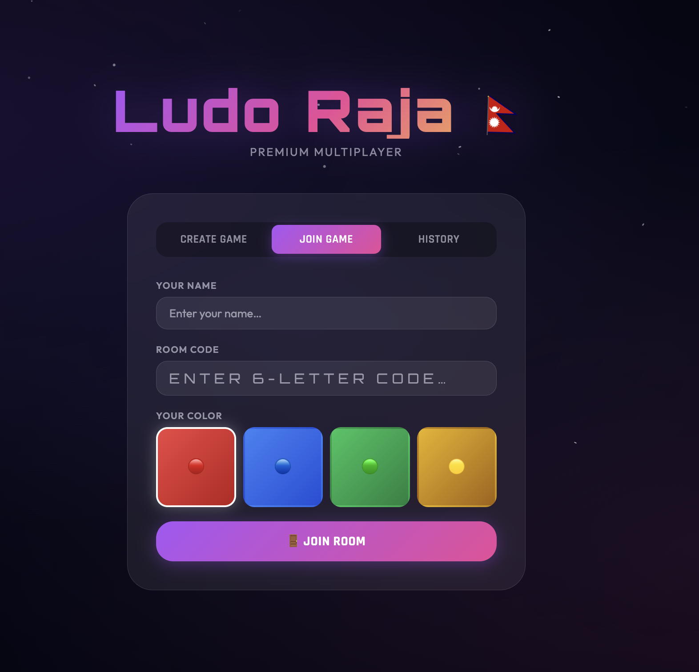
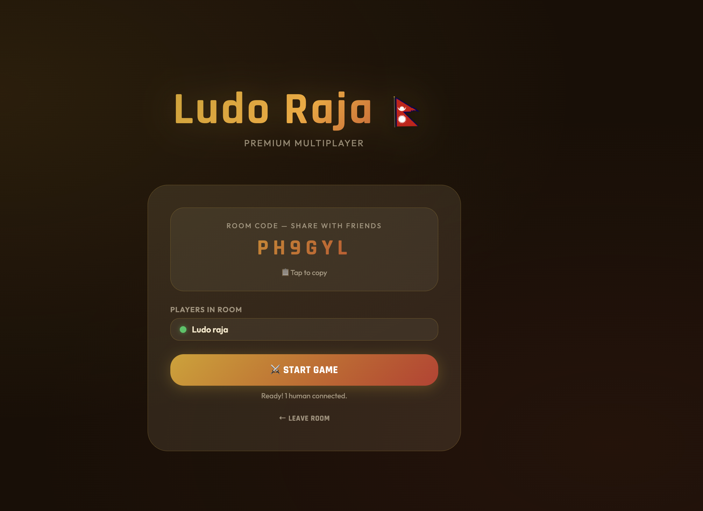
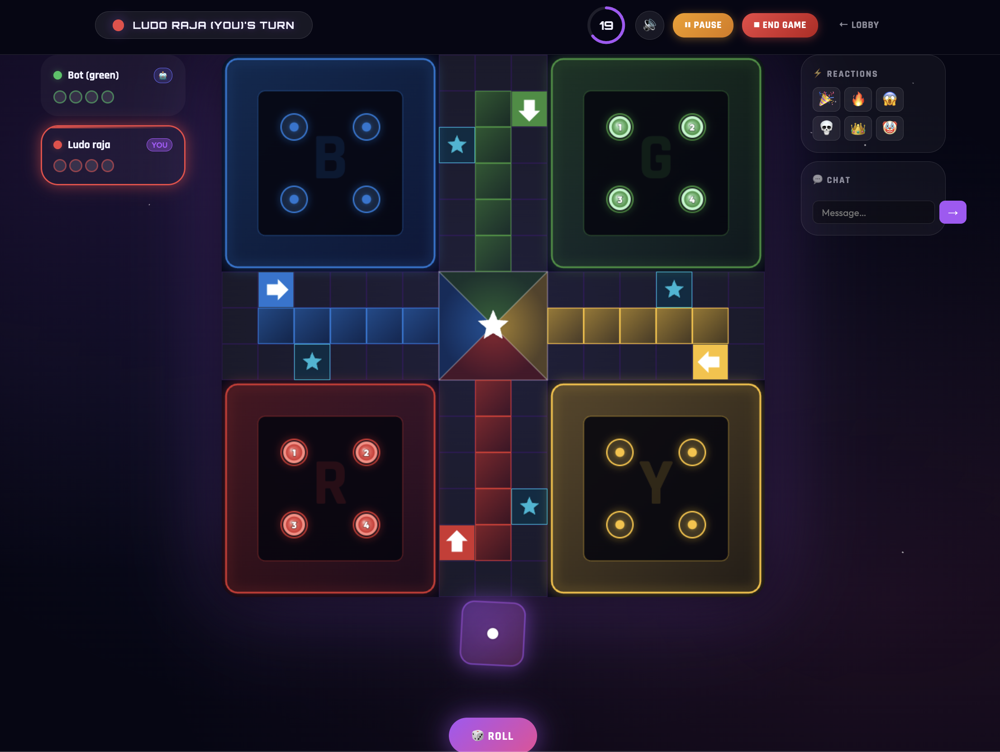
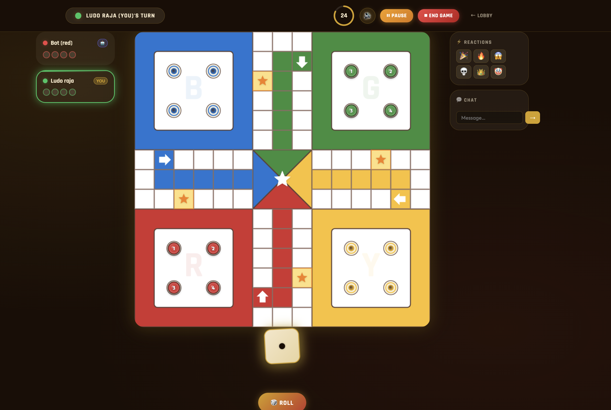

# 🎲 Ludo Raja — Premium Multiplayer Ludo

<div align="center">


**A visually stunning, real-time multiplayer Ludo game you host locally on your Mac and play across WiFi — no app installs, no internet required.**

[Screenshots](#-screenshots) • [Features](#-features) • [Quick Start](#-quick-start) • [WiFi Play](#-wifi-multiplayer) • [How to Play](#-how-to-play) • [Redis Setup](#-redis-setup) • [Render Deploy](#️-deploy-to-render-cloud-hosting) • [Project Structure](#-project-structure) • [Tech Stack](#-tech-stack)

</div>

---

## 📸 Screenshots

<div align="center">

### Lobby — Create Game


### Lobby — Join Game


### Waiting Room (Classic Theme)


### Galaxy Board 🌌


### Classic Board ♟️


</div>

---

## ✨ Features

### 🎮 Gameplay
- ✅ **2–4 players** — host chooses how many slots before starting
- ✅ **AI Bot players** — per-slot toggle (Human / Bot 🤖) to fill any seat
- ✅ **Smart Bot AI** — priority-based: Win > Capture > Safe Square > Escape > Enter > Advance
- ✅ **30-second turn timer** — animated ring countdown, auto-skips on timeout
- ✅ **Full Ludo rules** — rolling 6 to enter, captures, safe squares, home column, triple-six forfeit
- ✅ **Extra turn** on rolling 6 or sending a token home
- ✅ **Bonus roll** on getting a token to the finish
- ✅ **Auto-move** — if only one token is movable, it moves automatically after 1 second
- ✅ **Timer auto-pick** — if a human's move-selection timer expires, the best token is auto-chosen by the bot AI

### 🌐 Multiplayer
- ✅ **Local WiFi hosting** — runs entirely on your Mac, zero internet needed
- ✅ **Room codes** — 6-character alphanumeric codes to share with friends
- ✅ **Real-time sync** — every dice roll and token move instantly reflected on all devices
- ✅ **Reconnect** — rejoin a live game using the room code; mid-game joiners receive full current state immediately
- ✅ **Disconnect-to-bot** — if a human player disconnects mid-game, their slot converts to a bot seamlessly
- ✅ **Stable host identity** — host authority is tied to color, not socket ID, so it survives page refreshes
- ✅ **Emoji reactions** — 🎉🔥😱💀👑🤡 one-tap reactions
- ✅ **Live chat** — in-game text chat between players

### ⏸️ Game Controls (Host Only)
- ✅ **Pause / Resume** — host can pause and resume the game at any time; all players see a paused overlay
- ✅ **Force End** — host can end the game early; final standings are calculated from token progress
- ✅ **Game History** — completed rooms store a result summary (rankings, duration, theme) for 24 hours

### 🔗 Sharing & Social
- ✅ **Share link** — generates a `/?join=CODE&host=NAME` URL; tapping it pre-fills the room code for the invitee
- ✅ **Open Graph meta tags** — the share URL renders a rich preview card on WhatsApp, iMessage, Discord, etc.
- ✅ **Recent rooms** — lobby shows a history tab with recently joined/created rooms for quick re-entry

### 🎨 Dual Board Themes
| | Galaxy 🌌 | Classic ♟️ |
|---|---|---|
| **Background** | Deep space + nebula gradients | Warm walnut wood |
| **Board** | Neon glow + glassmorphism | Parchment + jewel tones |
| **Dice** | 3D cosmic shimmer | Classic white with pips |
| **Font** | Orbitron (futuristic) | Rajdhani (bold) |
| **Animations** | Star-field + neon pulses | Gold shimmer |

### 🔊 Premium Sound (synthesized, offline-ready)
| Event | Sound |
|-------|-------|
| Dice roll | Rattling tumble with pitch variation |
| Token move | Satisfying click per square |
| Capture | Dramatic impact boom |
| Enter home | Ascending chime |
| Win | Full orchestral fanfare |
| Six rolled | Shimmer sparkle |
| Timer warning | Ticking heartbeat |

### 🎆 Visual Polish
- Confetti particle burst on winning (color-matched to winner)
- Glowing token highlights for movable pieces
- Animated countdown ring timer (green → yellow → red)
- Player strip showing all active players with turn indicator
- Move animations with action lock (no clicks during animation)
- Glassmorphism UI panels
- Micro-animations on every interaction

---

## 🚀 Quick Start

### Prerequisites
- **Node.js** v18 or higher ([download](https://nodejs.org))
- **npm** (comes with Node.js)
- **Redis** v6+ — optional but recommended for persistence (see [Redis Setup](#-redis-setup))

### Install & Run

```bash
# 1. Clone the repo
git clone https://github.com/JKL404/Ludo-Raja.git
cd Ludo-Raja

# 2. Install dependencies
npm install

# 3. Start the game server
npm start
```

Then open your browser and go to:
```
http://localhost:3000
```

That's it! 🎉

> **Without Redis**: rooms are stored in-memory. They are lost if the server restarts and multi-instance deployments are not supported. This is fine for local WiFi play.

---

## 🔴 Redis Setup

Redis is **optional** for local play but **highly recommended** for cloud hosting. It provides:

- **Persistent rooms** — game state survives server restarts
- **Multi-instance support** — Socket.IO pub/sub adapter syncs events across all server processes
- **Game history** — completed match results stored with a 24-hour TTL

### Local Development

If Redis is running locally, the server connects to it automatically:

```bash
# macOS — install via Homebrew
brew install redis
brew services start redis

# The server auto-detects redis://127.0.0.1:6379
npm start
```

### Production (Render / any cloud)

Set the `REDIS_URL` environment variable:

```
REDIS_URL=redis://:password@your-redis-host:6379
```

The server uses this URL for both the **RoomStore** (game state) and the **Socket.IO Redis adapter** (pub/sub). If the connection fails, it falls back to in-memory gracefully with a console warning.

### Redis Key Schema

| Key | TTL | Contents |
|-----|-----|----------|
| `room:<CODE>` | 24 hours | Serialized `GameRoom` state (players, game, timer) |
| `history:<CODE>` | 24 hours | Match result: rankings, duration, theme, reason |

---

## ☁️ Deploy to Render (Cloud Hosting)

Play from **anywhere in the world** by deploying to [Render.com](https://render.com) — free tier available, no credit card required.

### Option A — One-Click Blueprint (Recommended)

1. Push your code to GitHub (already done ✅)
2. Go to **[dashboard.render.com/web/new](https://dashboard.render.com/web/new?onboarding=active)**
3. Click **"Connect a repository"** → Select `JKL404/Ludo-Raja`
4. Render auto-detects `render.yaml` and fills everything in
5. Click **"Apply"** — done! 🚀

Your app will be live at `https://ludo-raja.onrender.com` (or similar) in ~2 minutes.

### Option B — Manual Setup

1. Go to **[dashboard.render.com/web/new](https://dashboard.render.com/web/new)**
2. Connect your GitHub account → select `JKL404/Ludo-Raja`
3. Configure:

| Setting | Value |
|---------|-------|
| **Name** | `ludo-raja` |
| **Runtime** | `Node` |
| **Build Command** | `npm install` |
| **Start Command** | `npm start` |
| **Plan** | Free |

4. Add environment variables:
   - `NODE_ENV` = `production`
   - `REDIS_URL` = *(your Redis connection string — see below)*
5. Click **"Create Web Service"**

### Adding Redis on Render

Render has a managed Redis service:

1. In your Render dashboard, go to **New → Redis**
2. Pick a name (e.g. `ludo-redis`) and region matching your web service
3. Free tier gives 25 MB — more than enough for hundreds of concurrent rooms
4. Copy the **Internal URL** and paste it as the `REDIS_URL` env var on your web service

> **Without Redis on Render**: rooms work in-memory on a single instance. If Render spins up a second instance or restarts your service, in-progress games will be lost. Redis prevents this.

### What Render Gets Automatically

| Feature | How it works |
|---------|-------------|
| **Dynamic PORT** | `process.env.PORT` — Render injects this automatically |
| **WebSockets** | Render supports WebSockets natively on all plans |
| **HTTPS/SSL** | Free auto-SSL on `*.onrender.com` domains |
| **Health check** | `GET /health` — Render pings this to verify your service is up |
| **Auto-deploy** | Every `git push` to `main` triggers a redeploy |
| **Graceful shutdown** | `SIGTERM` handler ensures zero-downtime deploys |

> **⚠️ Free Tier Note**: Render's free tier spins down after 15 minutes of inactivity. The first request after idle takes ~30s to wake up. Upgrade to Starter ($7/mo) for always-on hosting.

---

## 📱 WiFi Multiplayer

This is the killer feature — **your Mac becomes the game server** and everyone on the same WiFi plays in their browser. No installs, no accounts.

### Step 1 — Find Your Mac's IP Address
```bash
ipconfig getifaddr en0
# Example output: 192.168.1.42
```

### Step 2 — Share the URL
Send this to your friends on the **same WiFi network**:
```
http://192.168.1.42:3000
```

### Step 3 — Play!
- **Host**: Go to `http://localhost:3000`, create a room, configure slots & theme
- **Friends**: Go to `http://192.168.1.42:3000`, join with the room code

```
[Your Mac — Game Server]
         │
         ├── You (localhost:3000) ──── Chrome / Safari
         ├── Friend 1 (phone/tablet) ── Chrome / Safari
         ├── Friend 2 (laptop) ──────── Chrome / Safari
         └── Friend 3 (iPad) ────────── Chrome / Safari
```

> **Works on**: Chrome, Safari, Firefox, Edge — any modern browser on any device.

---

## 🎯 How to Play

### Creating a Game
1. Open `http://localhost:3000`
2. Click **Create Game**
3. Choose your **theme** (Galaxy 🌌 or Classic ♟️)
4. Enter your **name** and pick a **color**
5. Configure **player slots** — set each slot to Human or Bot 🤖
6. Click **Create Room** → share the 6-letter code (or use the **Share** button to send a deep link)
7. Click **Start Game** when ready (minimum 2 slots needed)

### Joining a Game
1. Open the host's URL in your browser
2. Click **Join Game**
3. Enter your **name**, pick a **color**, enter the **room code**
4. Wait for the host to start
5. Tap a **share link** from WhatsApp/iMessage to have the room code pre-filled automatically

### In-Game Rules
| Rule | Details |
|------|---------|
| **Enter the board** | Roll a **6** to move a token from yard to start |
| **Rolling a 6** | Grants an **extra turn** |
| **Triple 6** | Three consecutive 6s = forfeit turn |
| **Capture** | Land on an opponent's token → they go back to yard |
| **Safe squares** | ⭐ Star squares — cannot be captured there |
| **Home column** | Final 6 colored squares — only your tokens can enter |
| **Finish** | Get all 4 tokens home to win |
| **Turn timer** | 30 seconds per turn — auto-skipped on timeout |
| **Auto-move** | If only one token is movable, it moves automatically |

### Controls
- **🎲 ROLL button** — roll the dice on your turn
- **Click a token** — move it after rolling (highlighted tokens are movable)
- **⏸ Pause** *(host only)* — pause the game; all players see a paused overlay
- **▶ Resume** *(host only)* — resume from pause
- **⛔ End Game** *(host only)* — force-end with current standings
- **Emoji buttons** — send quick reactions
- **Chat box** — type messages to other players
- **🔊 toggle** — mute/unmute all sounds

---

## 📁 Project Structure

```
Ludo-Raja/
│
├── server.js                    # Express + Socket.IO server (entry point)
├── package.json
├── render.yaml                  # Render.com Blueprint for one-click deploy
├── .gitignore
│
├── game/                        # Server-side game logic
│   ├── constants.js             # Board path (52 cells), home columns, safe squares
│   ├── LudoGame.js              # Core rules engine (moves, captures, win detection)
│   ├── GameRoom.js              # Room lifecycle, timers, bot automation, pause/resume
│   ├── RoomStore.js             # Storage abstraction (Redis + in-memory fallback)
│   └── BotPlayer.js             # AI heuristic decision engine
│
└── public/                      # Frontend (served as static files)
    ├── index.html               # Lobby page (create, join, recent rooms, share links)
    ├── game.html                # Game board page
    │
    ├── css/
    │   ├── main.css             # Global design tokens, Galaxy & Classic themes
    │   ├── lobby.css            # Lobby-specific styles
    │   └── game.css             # Board, HUD, timer, player cards, win overlay, paused overlay
    │
    └── js/
        ├── sound.js             # Web Audio API synthesized sound engine
        ├── particles.js         # Confetti particle system (win celebration)
        ├── timer.js             # SVG ring countdown timer
        ├── board.js             # HTML5 Canvas board renderer (theme-aware, animation callbacks)
        ├── dice.js              # 3D CSS dice animation controller
        ├── socket-client.js     # Socket.IO client wrapper
        ├── lobby.js             # Lobby page logic (recent rooms, share, history tab)
        └── game.js              # Main game controller (orchestrates everything)
```

---

## 🛠 Tech Stack

| Layer | Technology | Why |
|-------|-----------|-----|
| **Server runtime** | Node.js | Lightweight, fast, native JS |
| **HTTP server** | Express.js | Minimal REST API for room creation |
| **Real-time** | Socket.IO | WebSocket-based instant game sync |
| **Pub/Sub adapter** | @socket.io/redis-adapter | Scales Socket.IO across multiple instances |
| **Persistence** | Redis (optional) | Room state + game history with TTL |
| **Board rendering** | HTML5 Canvas | Smooth, theme-aware 2D rendering |
| **Animations** | Vanilla CSS | 3D dice, timer ring, token glow |
| **Sound** | Web Audio API | Synthesized sfx — no audio files needed |
| **Fonts** | Google Fonts | Orbitron, Rajdhani, Outfit |
| **Frontend** | Vanilla HTML/CSS/JS | Zero build step, runs in any browser |

---

## 🔌 Socket.IO Events Reference

### Client → Server
| Event | Payload | Description |
|-------|---------|-------------|
| `join-room` | `{ roomCode, name, color }` | Join a room |
| `start-game` | `{ roomCode, slotConfig, theme }` | Host starts the game |
| `roll-dice` | — | Roll the dice on your turn |
| `move-token` | `{ tokenId }` | Move a specific token |
| `pause-game` | — | Host pauses the game |
| `resume-game` | — | Host resumes a paused game |
| `force-end-game` | — | Host force-ends the game |
| `reaction` | `{ emoji }` | Send emoji reaction |
| `chat` | `{ message }` | Send chat message |

### Server → Client
| Event | Payload | Description |
|-------|---------|-------------|
| `joined` | `{ color, roomCode }` | Confirmed join |
| `room-updated` | Room info | Players list changed |
| `game-started` | `{ slotConfig, hostColor, theme, state, isPaused? }` | Game begins (or state sent on rejoin) |
| `dice-rolled` | `{ color, value, movable, tripleSix, noMoves, state }` | Dice result |
| `token-moved` | `{ color, tokenId, captured, reachedHome, extraTurn, win, autoMoved?, state }` | Token moved |
| `turn-skipped` | `{ reason, state }` | Turn timed out |
| `timer-start` | `{ duration, color }` | New turn timer |
| `game-paused` | `{ pausedBy }` | Game was paused |
| `game-resumed` | `{ state }` | Game was resumed |
| `game-ended` | `{ reason, rankings, state }` | Game ended (force-end or win) |
| `reaction` | `{ name, emoji }` | Player reacted |
| `chat` | `{ name, color, message, ts }` | Chat message |

---

## 🔗 REST API

| Method | Path | Description |
|--------|------|-------------|
| `GET` | `/health` | Health check — returns `{ status, uptime }` |
| `POST` | `/api/rooms` | Create a new room — returns `{ roomCode }` |
| `GET` | `/api/rooms/:code` | Get room info (status, players, slotConfig) |
| `GET` | `/api/history/:code` | Get match result for a finished room (24h TTL) |
| `GET` | `/?join=CODE&host=NAME` | Lobby with pre-filled room code + OG meta tags |

---

## 🤖 Bot AI Strategy

The bot uses a **priority-based heuristic** — not random, but still beatable:

1. 🏆 **Win move** — if a token can reach home, do it
2. 💥 **Capture opponent** — if landing kills an opponent, take it
3. ⭐ **Land on safe square** — if landing makes you safe, prefer it
4. 🏃 **Escape danger** — move a token that's threatened by nearby opponents
5. ▶️ **Enter board** — always bring out a new token on a 6
6. 📈 **Advance furthest** — push the token closest to home

Bot response delay: **1.2s – 1.8s** (feels human, not instant). The same AI is used to auto-pick a token when a human player's move-selection timer expires.

---

## ⚙️ Environment Variables

| Variable | Default | Description |
|----------|---------|-------------|
| `PORT` | `3000` | HTTP port (Render injects this automatically) |
| `NODE_ENV` | `development` | Set to `production` for cloud deploys |
| `REDIS_URL` | *(none)* | Redis connection URL. In dev, falls back to `redis://127.0.0.1:6379` if not set |

---

## 🎨 Theme Customization

Themes are controlled via CSS variables in `public/css/main.css`. You can easily customize:

```css
/* Galaxy Theme */
:root {
  --bg-primary:   #060614;
  --accent-1:     #a855f7;   /* Purple */
  --accent-2:     #ec4899;   /* Pink */
  --clr-red:      #ef4444;
  --clr-blue:     #3b82f6;
  --clr-green:    #22c55e;
  --clr-yellow:   #eab308;
}

/* Classic Theme */
[data-theme="classic"] {
  --bg-primary:   #1a0e06;
  --accent-1:     #d4a017;   /* Gold */
  --accent-2:     #c0392b;   /* Red */
}
```

---

## 🙌 Credits

Built with ❤️ as a premium local WiFi multiplayer experience.

- **Fonts**: [Google Fonts](https://fonts.google.com) — Orbitron, Rajdhani, Outfit
- **Real-time**: [Socket.IO](https://socket.io)
- **Redis adapter**: [@socket.io/redis-adapter](https://github.com/socketio/socket.io-redis-adapter)
- **Sound**: Synthesized entirely with the [Web Audio API](https://developer.mozilla.org/en-US/docs/Web/API/Web_Audio_API)
- **No external assets** — everything is generated in-browser or server-side

---

## 📄 License

ISC © [JKL404](https://github.com/JKL404)
